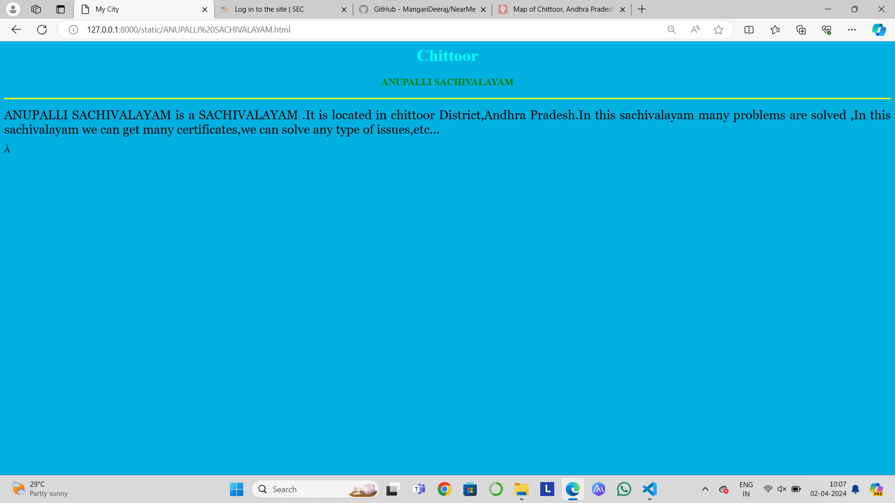

# Ex04 Places Around Me
## Date: 

## AIM
To develop a website to display details about the places around my house.

## DESIGN STEPS

### STEP 1
Create a Django admin interface.

### STEP 2
Download your city map from Google.

### STEP 3
Using ```<map>``` tag name the map.

### STEP 4
Create clickable regions in the image using ```<area>``` tag.

### STEP 5
Write HTML programs for all the regions identified.

### STEP 6
Execute the programs and publish them.

## CODE
```
map.html

map.html

<html>
    <head>
        <title>My City</title>
    </head>
    <body>
        <h1 align="center">
            <font color="red"><b>CHITTOOR</b></font>
        </h1>
        <h3 align="center">
            <font color="blue"><b>MANGARI DEERAJ (212223100031)</b></font>
        </h3>
        <center>
            
            <map name="MyCity">
                <area target="" alt="collage" title="collage" href="COLLAGE FOR NURSING,CMC.html" coords="698,365,913,496" shape="rect">
                <area target="" alt="village" title="village" href="KURAPALLI VILLAGE.html" coords="250,360,220,100" shape="circle">
                <area target="" alt="sachivalayam" title="sachivalayam" href="ANUPALLI SACHIVALAYAM.html" coords="700,250,600,300" shape="rect">
                <area target="" alt="factory" title="factory" href="NEW RANGA FOOD PRODUCTS.html" coords="580,300,50,50" shape="circle">
                <area target="" alt="temple" title="temple" href="VINAYAKA SWAMI TEMPLE.html" coords="60,60,150,150" shape="rect">
                <area target="" alt="" title="" href="" coords="" shape="0">
    
            </map>
        </center>  
    </body>
</html>

ANUPALLI SACHIVALAYAM

<html>
    <head>
        <title>My City</title>
    </head>
    <body bgcolor="sky blue">
        <h1 align="center">
            <font color="cyan"><b>Chittoor</b></font>
        </h1>
        <h3 align="center">
            <font color="green"><b>ANUPALLI SACHIVALAYAM</b></font>
        </h3>
        <hr size="3" color="yellow">
        <p align="justify">
            <font face="Georgia" size="5" color="black">
                ANUPALLI SACHIVALAYAM   is a SACHIVALAYAM .It is located in chittoor District,Andhra Pradesh.In this sachivalayam
                many problems are solved ,In this sachivalayam we can get many certificates,we can solve any type of issues,etc...
 
            </font>
        </p>
    </body>
</html>

NEW RANGA FOOD PRODUCTS

<html>
    <head>
        <title>My City</title>
    </head>
    <body bgcolor="orange">
        <h1 align="center">
            <font color="cyan"><b>Chittoor</b></font>
        </h1>
        <h3 align="center">
            <font color="red"><b>NEW RANGA FOOD PRODUCTS</b></font>
        </h3>
        <hr size="3" color="red">
        <p align="justify">
            <font face="Georgia" size="5" color="black">
                NEW RANGA FOOD PRODUCTS is the famous factory in chittoor District.NEW RANGA FOOD PRODUCTS it makes many types of 
                food productes and jucies like mango,banana,guava,etc.. and also this factory is helpfull for many farmers ,many
                people for jobs,etc...
            </font>
        </p>
    </body>
</html>

KURAPALLI VILLAGE

<html>
    <head>
        <title>My City</title>
    </head>
    <body bgcolor="violet">
        <h1 align="center">
            <font color="cyan"><b>Chittoor</b></font>
        </h1>
        <h3 align="center">
            <font color="green"><b> KURAPALLI VILLAGE</b></font>
        </h3>
        <hr size="3" color="yellow">
        <p align="justify">
            <font face="Georgia" size="5" color="black">
                KURAPALLI  is a village.It is located in chittoor District,Andhra Pradesh.In this village it has a childrens park.
                It is very famous park in chittoor.In this park it has different type of playable things like cricket ground,some animals and etc.
            </font>
        </p>
    </body>
</html>

VINAKAYA SWAMI TEMPLE
<html>
    <head>
        <title>My City</title>
    </head>
    <body bgcolor="yellow">
        <h1 align="center">
            <font color="cyan"><b>Chittoor</b></font>
        </h1>
        <h3 align="center">
            <font color="green"><b>VINAYAKA SWAMI TEMPLE</b></font>
        </h3>
        <hr size="3" color="red">
        <p align="justify">
            <font face="Georgia" size="5" color="black">
                VINAYAKA SWAMI TEMPLE it is famous in our area ,In this temple lord vinayaka is placed,this temple celebrates 
                vinakaya chavathi festival in grand manner,and also celebrates many other festivals...
            </font>
        </p>
    </body>
</html>

COLLAGE FOR NURSING<CMC>

<html>
    <head>
        <title>My City</title>
    </head>
    <body bgcolor="purple">
        <h1 align="center">
            <font color="cyan"><b>Chittoor</b></font>
        </h1>
        <h3 align="center">
            <font color="lime"><b>COLLAGE FOR NURSING,CMC</b></font>
        </h3>
        <hr size="3" color="red">
        <p align="justify">
            <font face="Georgia" size="5" color="white">
                COLLAGE FOR NURSING,CMC it is under the controll of cristen medical collage..
                C.M.C it has two multi spelitity hospital,one in andhra pradheesh,seccond is in tamil nadu..
                This collage makes many of the talented students..
                This is beside the rode of chittoor high way.
            </font>
        </p>
    </body>
</html>


```

## OUTPUT





## RESULT
The program for implementing image maps using HTML is executed successfully.
